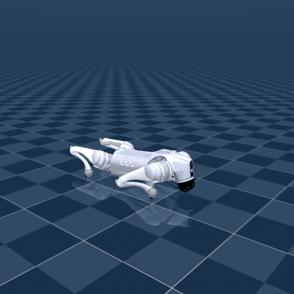
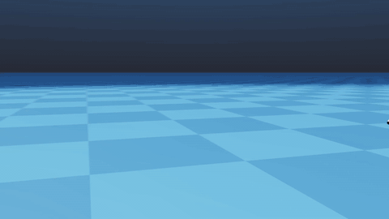
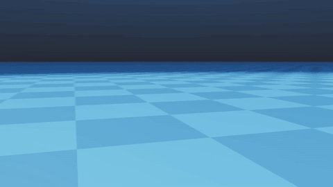

# Unitree Go2 MuJoCo control research

Research fork of [`unitreerobotics/unitree_mujoco`](https://github.com/unitreerobotics/unitree_mujoco) for Go2 **stand → walk → lie**, a model-based diagonal trot, and an Isaac Lab velocity-RL second track.



Two tracks. The C++ result is a 500 Hz LowCmd state machine: stand-up, settle, trot, blend back to stand, lie-down. Reliable C++ cruise is about **0.13–0.18 m/s**. Isaac Lab velocity RL (`rl/`) uses command curricula up to **±3.5 m/s**, fast but short-stride. Imitation work is in [`kairoi-k/kine2go-research`](https://github.com/kairoi-k/kine2go-research).




## Contents

`example/cpp/` is the research code:

- stand / walk / stop / lie sequencing at 500 Hz;
- diagonal-trot generation and Raibert footstep planning;
- world/support feedback and CSV logging;
- constrained contact-force allocation and a centroidal `--wbc-full` path (wrench QP + foothold MPC, `J^T f`); `--wbc-primary` is still incremental feedforward with PD fallback.

## Quick start (C++)

Needs MuJoCo, Unitree SDK2, and the upstream simulator dependencies. `scripts/setup_ubuntu_env.sh` installs system packages; read it before running.

```bash
cmake -S simulate -B simulate/build
cmake --build simulate/build -j"$(nproc)"

cmake -S example/cpp -B example/cpp/build
cmake --build example/cpp/build -j"$(nproc)"

./example/cpp/build/test_go2_forward_kinematics
./example/cpp/build/test_go2_inverse_kinematics
```

Stand-walk-lie (after the simulator is up): see [`example/cpp/README.md`](example/cpp/README.md). `go2sim task` is the sequenced entry; `go2sim walk` / `go2sim fast` are trot-only (fast ≈ 0.18 m/s with a looser torque gate). `go2sim full` turns on the centroidal `--wbc-full` path; see [`docs/WBC_MPC.md`](docs/WBC_MPC.md).

## Isaac Lab velocity RL

Gym-registered extension in `rl/`. No copy into `isaaclab_tasks`.

```bash
pip install -e rl
export ISAACLAB_PATH=/path/to/IsaacLab
python -m go2_velocity_fast.download -o model_54950.pt
python -m go2_velocity_fast.play --task Isaac-Velocity-Flat-Unitree-Go2-Fast35-v0 --num_envs 16 --checkpoint model_54950.pt
```

Details: [`rl/README.md`](rl/README.md). Checkpoint: [Release v0.1.0](https://github.com/kairoi-k/go2-mujoco-control/releases/tag/v0.1.0).

## Tracks

| Track | Where |
|---|---|
| Model-based C++ stand-walk-lie + slow trot | `example/cpp/` |
| Isaac Lab velocity RL (fast, short-stride) | `rl/` (`pip install -e rl`) |
| Kine2Go imitation, AMP, seam JSON | [`kairoi-k/kine2go-research`](https://github.com/kairoi-k/kine2go-research) |

## Map

```text
example/cpp/       controller, tests, runners, retained experiment artifacts
simulate/          Unitree MuJoCo simulator base
unitree_robots/    Go2 MJCF only (other Unitree robots stay upstream)
rl/                Isaac Lab gym-registered velocity curricula
docs/media/        README clips
patches/           simulator/runtime patches
scripts/           environment helpers
docs/              architecture, reproducibility, research history
```

## Docs

- [`docs/RESEARCH_INDEX.md`](docs/RESEARCH_INDEX.md) — claims vs this tree
- [`rl/README.md`](rl/README.md) — Isaac Lab velocity RL second track
- [`docs/RESEARCH_HISTORY.md`](docs/RESEARCH_HISTORY.md) — milestone history
- [`docs/ARCHITECTURE.md`](docs/ARCHITECTURE.md) — runtime/control architecture
- [`docs/CODE_GUIDE.md`](docs/CODE_GUIDE.md) — source map
- [`docs/REPRODUCIBILITY.md`](docs/REPRODUCIBILITY.md) — build notes
- [`example/cpp/experiments/CATALOG.md`](example/cpp/experiments/CATALOG.md) — experiment artifacts
- [`UPSTREAM_AND_CONTRIBUTIONS.md`](UPSTREAM_AND_CONTRIBUTIONS.md) — upstream boundary

## License

BSD 3-Clause from the Unitree simulator base. Third-party assets keep their own terms: [`NOTICE.md`](NOTICE.md), [`UPSTREAM_AND_CONTRIBUTIONS.md`](UPSTREAM_AND_CONTRIBUTIONS.md). Citation: [`CITATION.cff`](CITATION.cff).
