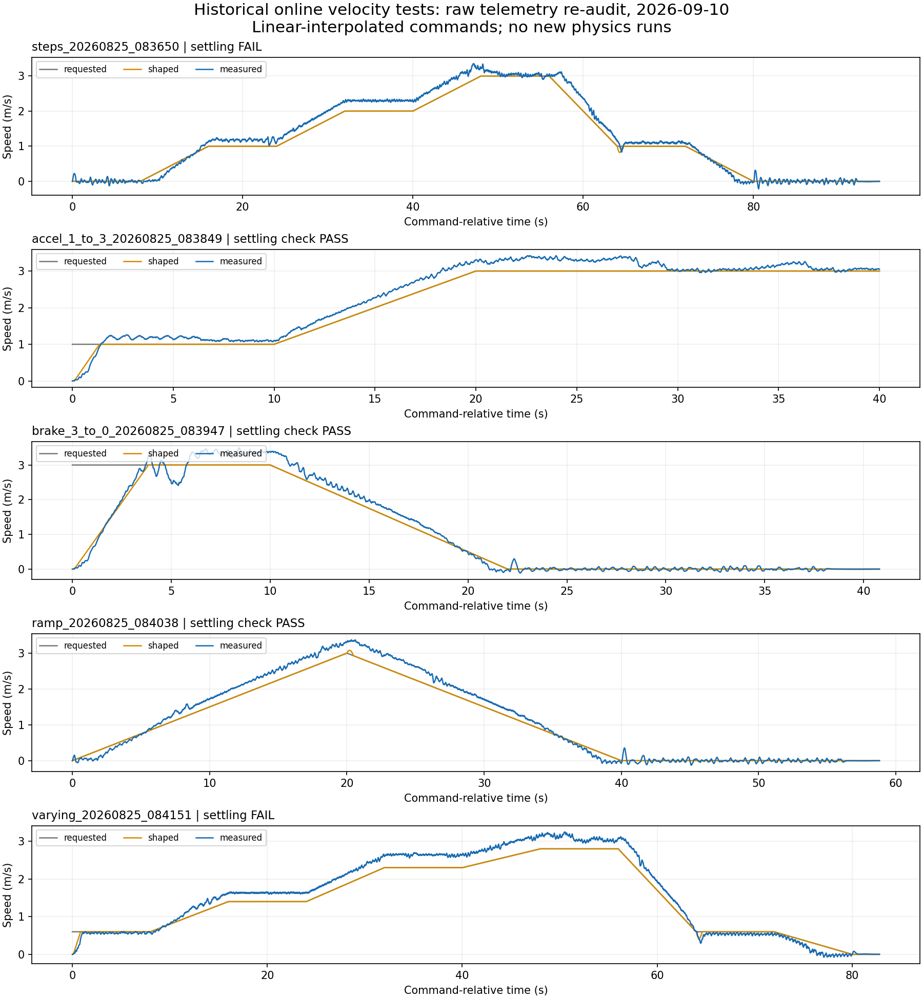

# Go2 运动控制阶段汇报（2026年9月10日）

本次新增成果是在线变速控制、一次实际5厘米跨越及其定量分析，以及面向复杂地形的联合规划原型。完整可靠的5厘米动态越障仍未完成。本次准备重审历史原始数据，没有新增闭环仿真，也没有修改控制器或冻结验收阈值。

## 建议开场

老师，上次汇报主要是事件响应和动作切换，以及1米/秒运动。这段时间我进一步实现了在线速度指令到步态、MPC和WBC的统一控制链，做了五类变速实验；同时探索5厘米台阶，已有一次完整跨越的仿真记录。为确认结果可靠，我又复核了原始数据，发现部分速度段仍存在跟踪偏差，越障也尚未保持理想跑步接触结构。下面分别汇报已实现的能力、证据和下一步。

## 相对8月21日的新增内容

老师此前已收到统一事件响应层、49种切换测试、自动障碍/低摩擦应对及1米/秒运动。这些作为前期基础，不重复算新增成果。以下比较依据本次提供的聊天截图，不是对此前49种测试的重新认证。

在线变速不再仅演示单一固定速度：指令经过加速度与加加速度限制，连续生成步态与SRBD-MPC参考，再由ID-WBC计算关节控制。历史版本进行了五类工况各三次有效实验，包含0.6、1.4、2.3、2.8米/秒等非整数目标。另有约3.23米/秒持续跑的历史三次验证；该固定速度结果今晚未重新运行，不替代变速结论。

## 今晚最重要的复核结果

从历史归档恢复全部15次变速原始CSV，核对它们均记录为干净源码07cbc7efdd17b9960897e277f401654c46410e48。五份指令配置与该Git版本逐字节一致；归档SHA-256与保留清单相符。用独立稳定保持检查重审，并另写不调用该分析器的逐窗口数值检查，42个过渡判断全部一致。分析器10个反例/边界测试通过。

| 历史工况名 | 有效实验数 | 今晚稳定保持检查 | 应如何解释 |
|---|---:|---:|---|
| steps | 3 | 0通过、3失败 | 三次均有0→1、1→2米/秒过渡未满足完整保持条件 |
| accel_1_to_3 | 3 | 3通过 | 1→3指令用10秒逐渐增加，随后保持；不是突发阶跃 |
| brake_3_to_0 | 3 | 3通过 | 3→0指令用12秒逐渐降低；不是紧急制动测试 |
| ramp | 3 | 3通过 | 沿用历史转折点窗口检查，不等于斜坡全程精确跟踪 |
| varying | 3 | 0通过、3失败 | 三次均有0.6→1.4、1.4→2.3、2.3→2.8过渡未满足保持条件 |

“9通过、6失败”仅指此次稳定保持诊断，不是完整重新验收或成功率估计。原15次历史“通过”文件原样保留。旧分析器会丢掉未稳定过渡，还可能把短于一秒的末尾记录视为完整保持：首次steps的0→1过渡只剩约0.220秒，却曾被计作稳定。新增检查保持原速度容差和期限，要求完整一秒记录；没有为通过而放宽要求。

所有五类输入实际上都是分段线性插值。“steps”名称并不代表瞬时阶跃。因此目前不能声称已验证任意快速变速、突发急停、随机指令、不同步态相位、扰动或复杂地形下的变速。误差和超调并未让这些旧实验全部失稳，但确实限制了可宣称的跟踪质量。

曲线取每类第一次有效实验，避免挑最好看的结果。绘图降采样至约50Hz，所有审计使用完整原始采样。灰线是请求速度、橙线是整形后速度、蓝线是实测速度。velocity_trace.mp4是这些数据的游标动画，明确不是机器人仿真视频。

## 5厘米跨越：实际发生了什么

播放recorded_5cm_traversal.mp4。它对应历史源码eeb5d757620712759604d8c51b2b9075d05625dc，是已记录状态的可视化，不是今晚新跑的实验。视频哈希与历史记录一致。

四脚都曾在台面形成持续支撑，身体与四脚完成离台，没有非足部台阶碰撞或安全停机；交互阶段速度中位数约0.850米/秒。今晚重放旧版平地、越障和归因调试三组分析，结果与历史记录完全一致，原始输入哈希也一致。

但四腿均出现非台面接触，7个完整交互周期仅1个满足保留的跑步拓扑，状态与指令时钟漂移28.318毫秒，超过该版本20毫秒门槛。前脚首次接触前的关键窗口没有可用地形执行计划，因此不能把成功归功于主动地形规划。可以说“完成过5厘米跨越”，不能说“可靠的地形感知动态越障已解决”。同源码平地已有46/49个合格周期，但越障尚无今晚新增复跑或成功率统计。

视频适合展示整体运动，不适合判断毫米级碰撞间隙；接触结论来自日志。此次核验发现旧源码清单混入三份后续文档，但运行/构建/测试源文件均与历史Git一致；详见证据包中的b1_verification.json。

## 联合规划：架构与已完成范围

长期目标是把状态与地形输入、身体/足端/接触力联合规划、计划验证和一致执行连接起来。变速整形器继续统一管理速度指令；计划应携带绝对时间、坐标系、接触事件和已承诺执行前缀，避免身体、摆腿与力控制各自使用不同计划。异步是待验证的执行方案，不是已经落地的成果。

已有typed schema、落地事件/候选、失败分类、离散比较与小规模oracle基础，连续动力学子问题，以及基于MuJoCo完整动力学的力矩优化原型和独立回放检查。这些是不同阶段的研究组件，尚未集成为完整联合规划控制器。

当前全身原型通过四个力矩修正节点改变身体、足端和接触力，但尚未充分开放落脚区域与摆腿形状选择。使用已知场景和记录初始状态，同步求解140毫秒未来、执行10毫秒，不是实时感知闭环产品。

9月9日原型执行0.16秒后，在实际触及台阶前停止：已有未来130毫秒的控制序列保持一致，新增末尾出现侧壁接触及约182.945牛预测力，20次迭代未找到合格替代。求解p50/p95/max为16.814/17.451/17.633秒。执行状态、接触力及控制回放差为零，但这只确认短段重放一致，不能证明越障成功或全局无解。

这一实验推翻了“只要每个短窗口可行，就能连续越障”的假设。当前主要问题是续接可行性、运动选择自由度和实时计算，而不是继续把旧分析器调绿。求解器主路线尚待论文与成熟项目对比选型，不能宣称已选定最佳方案。

## 后续里程碑与今晚边界

近期先解决变速已知偏差并复核全部过渡，再增加真正快速切换、不同步态相位和长时间运行测试。联合规划先完成文献/开源实现选型与失败现场对照，然后验证完整越障动作、可重复5厘米闭环、实时与异步执行，最后独立验证10厘米扩展性。

今晚没有为了赶汇报修改控制器或放宽阈值。发现历史测试的可复现失败后，优先收束证据，没有开展新变速压力实验、旧版越障复跑或新架构实现。本次交付的是可核查的阶段成果包，不是“所有功能完善”的新发布版本。

## 展示顺序与附件

建议5—8分钟：先说明上次基础与新增目标；展示变速曲线，诚实解释通过项与偏差；播放5厘米视频并给出接触数据；最后讲联合规划的已实现范围、失败教训和里程碑。无需逐项讲内部调试历史。

results.csv记录全部15次结果。velocity_profiles.png是五类代表曲线。velocity_trace.mp4是数据动画；recorded_5cm_traversal.mp4是旧版机器人记录回放。研究证据包保留独立检查、来源哈希和复现脚本。不要把两段视频都称作新闭环实验。
