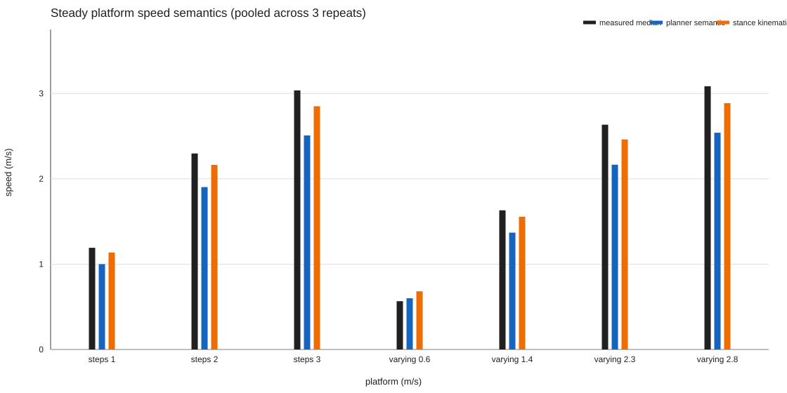

# Phase1 velocity speed-semantic attribution

日期：2026-09-13。研究底座为 controller SHA `a1d4e294092a39c8e649eda6f285ea2cfe01b05d`；诊断分支及上一阶段提交为 `research/phase1-velocity-failure-attribution-20260913` / `cb0b7eb33d8ea2ae87ee92ada353ad814a5f087c`。本阶段只读取上一阶段六个 raw run、源码和 Git history，没有运行 MuJoCo，没有修改 controller、参数、profile、阈值或物理模型，也没有进入 Phase2、terrain、crawl、Stage C、joint planner 或 whole-body MPC。

## 输入、命令和复现结果

本阶段没有新的仿真运行。上一阶段原样执行的六条 wrapper 命令为：

```text
bash example/cpp/scripts/run_phase1_velocity_benchmark.sh steps   _runs/phase1_velocity_failure_attribution_20260913 210
bash example/cpp/scripts/run_phase1_velocity_benchmark.sh steps   _runs/phase1_velocity_failure_attribution_20260913 211
bash example/cpp/scripts/run_phase1_velocity_benchmark.sh steps   _runs/phase1_velocity_failure_attribution_20260913 212
bash example/cpp/scripts/run_phase1_velocity_benchmark.sh varying _runs/phase1_velocity_failure_attribution_20260913 213
bash example/cpp/scripts/run_phase1_velocity_benchmark.sh varying _runs/phase1_velocity_failure_attribution_20260913 214
bash example/cpp/scripts/run_phase1_velocity_benchmark.sh varying _runs/phase1_velocity_failure_attribution_20260913 215
```

本阶段唯一分析命令：

```text
python3 example/cpp/tools/analysis/analyze_phase1_velocity_semantics.py \
  --root example/cpp/experiments/_runs/phase1_velocity_failure_attribution_20260913 \
  --out example/cpp/experiments/_runs/phase1_velocity_failure_attribution_20260913/analysis_semantics \
  --repo .
```

| 场景 | run | active 时长(s) | 上一阶段完整 1s 失败 transition |
|---|---|---:|---|
| steps | `steps_20260913_130149` | 94.804 | 0→1、1→2 |
| steps | `steps_20260913_130415` | 94.802 | 0→1、1→2 |
| steps | `steps_20260913_130640` | 94.804 | 0→1、1→2 |
| varying | `varying_20260913_130859` | 82.802 | 0.6→1.4、1.4→2.3、2.3→2.8 |
| varying | `varying_20260913_131059` | 82.804 | 0.6→1.4、1.4→2.3、2.3→2.8 |
| varying | `varying_20260913_131301` | 82.804 | 0.6→1.4、1.4→2.3、2.3→2.8 |

六次共解析 266,418 个 active continuous-trot rows。profile sampler 是线性插值，因此真正的上升沿分别从 8、24、40 s 开始，到 16、32、48 s 达到目标；本报告按上升沿计时，endpoint 单独保留。此前按 16、32、48 s 标注的 transition 是 endpoint 口径，不再作为因果起点。

## 稳态平台

窗口为每个 8 s 常值平台末 4 s；varying 的 0.6 平台为 4–8 s。下表为三次重复 pooled median，measured 的 p05/p95 也来自 pooled rows；逐 run 数值在 [`platform_steady_stats.csv`](../../example/cpp/experiments/_runs/phase1_velocity_failure_attribution_20260913/analysis_semantics/platform_steady_stats.csv) 和 JSON 中。

| 场景/目标 | req / shaped / applied | measured p05 / median / p95 | planner `step·2D/P` | stance `step/P` | measured−applied / −planner / −stance |
|---|---|---|---:|---:|---|
| steps 1.0 | 1.000 / 1.000 / 1.000 | 1.131 / 1.192 / 1.221 | 1.000 | 1.136 | +.192 / +.192 / +.055 |
| steps 2.0 | 2.000 / 2.000 / 1.903 | 2.260 / 2.297 / 2.333 | 1.903 | 2.162 | +.394 / +.394 / +.135 |
| steps 3.0 | 3.000 / 3.000 / 2.508 | 2.925 / 3.036 / 3.154 | 2.508 | 2.850 | +.505 / +.505 / +.156 |
| varying 0.6 | .600 / .600 / .600 | .541 / .566 / .597 | .600 | .682 | −.034 / −.034 / −.116 |
| varying 1.4 | 1.400 / 1.400 / 1.369 | 1.616 / 1.631 / 1.651 | 1.369 | 1.556 | +.262 / +.262 / +.076 |
| varying 2.3 | 2.300 / 2.300 / 2.166 | 2.581 / 2.634 / 2.683 | 2.166 | 2.461 | +.469 / +.469 / +.173 |
| varying 2.8 | 2.800 / 2.800 / 2.540 | 2.990 / 3.085 / 3.187 | 2.540 | 2.886 | +.534 / +.534 / +.187 |

按每个 run×平台的 median 计，7 个平台×3 次重复共 21 个 run×平台，其中 18 个 measured 更接近 stance `step/P`；每个 1.4、2.3、2.8 平台均为 3/3 重复一致。0.6 m/s 的 3 次均更接近 planner semantic，是 3/3 反例。因此 A 不是全速度域支持，而是除最低平台外的稳定模式。



## Transition 因果时序

事件均为每个 run 在 `[rise onset, next rise onset)` 内的首个 active row；`overspeed braking branch` 直接重建源码条件 `shaped > 0.90 && measured−shaped > tracking_lead`，lead 从六个 run metadata 读取，均为 0.20 m/s。表中是三次重复的 delta median，方括号是 min..max；`applied−overspeed` 全部为 0，表示同一采样行触发 exact branch 与 applied reduction。

| transition（onset→endpoint） | measured>shaped | measured>shaped+.20 | applied<shaped / branch | gap≥.05 | gap≥.10 | gap≥.20 |
|---|---:|---:|---:|---:|---:|---:|
| steps 0→1 (8→16) | .002 [0,5.932] | 8.412 [8.406,8.556] | 8.412 / 8.412 | 8.600 [8.554,9.184] | — | — |
| steps 1→2 (24→32) | 0 [0,0] | .840 [.818,.878] | .840 / .840 | .944 [.896,1.516] | 6.974 [5.850,7.910] | — |
| steps 2→3 (40→48) | 0 [0,0] | 0 [0,0] | 0 / 0 | 0 [0,0] | .194 [.010,.206] | 4.378 [2.144,5.522] |
| varying .6→1.4 (8→16) | .612 [.002,1.404] | 4.276 [3.580,4.856] | 4.276 / 4.276 | 4.898 [4.284,5.044] | 5.174 [5.174,5.174] | — |
| varying 1.4→2.3 (24→32) | .002 [0,.002] | .002 [0,.002] | .002 / .002 | .952 [.528,1.092] | 5.002 [4.590,5.240] | 13.058 [8.210,14.108] |
| varying 2.3→2.8 (40→48) | 0 [0,.002] | 0 [0,.002] | 0 / 0 | 0 [0,.002] | .002 [0,.060] | 3.570 [1.460,5.662] |

`measured>shaped` 在 18 个上升 transition 中都不晚于 applied reduction；代码顺序也是先读取 measured，再计算 applied。低中速的 applied gap 不是 shaped 自身被压低：shaper 的 request→shaped 仍按 profile 变化，governor 只写 `applied_mps`。

每个 run 的逐样本、四个时间偏移和全部字段见 [`transition_aligned_samples.csv`](../../example/cpp/experiments/_runs/phase1_velocity_failure_attribution_20260913/analysis_semantics/transition_aligned_samples.csv)。字段包括 requested、shaped、applied、measured、period、duty、schedule step、foot lift、planner/stance 两种速度、kernel error、FR/FL/RR/RL touchdown target、WBC velocity target、WBC requested acceleration、SRBD acceleration、ID contact force 及四个 solver/status 字段。关键曲线见 [`transition_causal_timing.svg`](../../example/cpp/experiments/_runs/phase1_velocity_failure_attribution_20260913/analysis_semantics/transition_causal_timing.svg)。

## 上游层级检查

当前源码证据为：`ScheduleContinuousVelocityGait` 在 [`velocity_command.h:186-200`](../../example/cpp/trot/velocity_command.h#L186) 固定 `P=.14,D=.44` 并设 `step=applied·P/(2D)`；runtime 在 [`trot_experiment_gait.cpp:164-206`](../../example/cpp/trot/trot_experiment_gait.cpp#L164) 先执行 measured-speed governor，再把 applied 送入 scheduler，并强制 effective-speed convention；kernel 在 [`raibert_trot_kernel.h:242-286`](../../example/cpp/gait/raibert_trot_kernel.h#L242) 计算 `nominal=step·2D/P`，但 stance travel 是 `step·D`、stance time 是 `D·P`，所以实际 stance 平均速度为 `step/P`。这高置信度确认 runtime gait speed semantic structural mismatch，即 planner/kernel nominal 与 stance trajectory 同时存在两套速度语义。

period 在六次 active rows 中均为 0.14 s，duty 均为 0.44；既有 3,684 个 STEPK cycle 事件中 schedule target 与 kernel actual 的最大绝对差为 `4.9998e-7 m`，没有 cycle-slew 跟不上 applied 的证据。foot-lift 是 runtime schedule 记录值（steps 全程范围 0–0.19961 m，varying 0–0.19600 m），没有 kernel 内部 actual lift 独立通道，故不对 lift actual 做过强结论。kernel footstep-plan valid、WBC full SRBD、ID-WBC 和 shadow solver status 在 266,418 rows 中均为 1.0。

Git history 的代码 diff 结论见 [`history_evidence.json`](../../example/cpp/experiments/_runs/phase1_velocity_failure_attribution_20260913/analysis_semantics/history_evidence.json)：初始 public snapshot `661d3bd` 已使用 `step/period`；`037c7c0` 引入 duty-based stance travel 但保留 kernel `step/period`；`77f0e8e` 是 1 m/s profile，未引入该 convention；`d41143f` 首次加入可选 `2·duty·step/period`，代码调用范围是 high-speed/sprint curriculum；`388310e` 延续 sustained sprint 验证；`048eb1b` 才把 arbitrary runtime path 固定为 `step= speed·period/(2·duty)`、并对 runtime 强制 effective convention 和 measured governor；`a1d4e29` 合并并继承这一 runtime convention。故 2·duty 不是为 Phase1 arbitrary velocity 独立设计，而是从 sprint convention 继承。

## 严格结论分级

| 项目 | 结论 | 证据强度 | 判断 |
|---|---|---|---|
| A. measured 更接近 step/period | **PARTIALLY SUPPORTED** | 中等 | 18/21 run×平台支持，0.6 m/s 为 3/3 反例；不能写成全域成立。 |
| B. applied governor 是主要原因 | **NOT SUPPORTED** | 高 | gap 是响应于先发生的 measured overspeed；无证据证明 governor 先造成 measured error。 |
| C. governor 主要响应先发生 overspeed | **SUPPORTED** | 高 | 18/18 transition 中 measured 先越过 shaped；达到 lead 后 exact branch 与 applied reduction 同行触发。 |
| D. runtime 中存在两套不一致的 gait speed semantic | **SUPPORTED** | 高（语义存在） | 源码代数直接给出 planner/kernel nominal=`step·2D/P`、stance trajectory=`step/P`；这是机制存在性结论，不等于已证明 settling 的物理根因。 |
| D2. semantic mismatch 是 settling failure 的物理根因 | **INCONCLUSIVE / UNPROVEN** | 中等 | measured overspeed→governor→applied/step 存在 feedback confounding；尚无物理 A/B 隔离。 |
| E. 现有数据足以批准下一阶段单变量物理 A/B | **SUPPORTED** | 中高 | 足以批准“做实验”的设计评审，不代表批准 B 组结果或发布修复。 |

其他候选层级：固定 period/duty 在本数据中没有表现为 period/duty 异常或 gait 参数滞后；Raibert plan valid 全部有效，touchdown target 已导出但不能解释最早 measured→shaped 偏离；WBC/SRBD/ID status 全通过，且后续请求的加速度方向与减速一致。因此它们不是当前证据下的第一处明显偏差，但本阶段没有用 A/B 排除其对最终误差的贡献。另有历史边界：已验收的 1 m/s running-trot 使用 `P=.26,D=.45,step=.312`，`step/P≈1.20`、`2D·step/P≈1.08`，实测 median 约 1.05–1.10 m/s，说明 2·duty convention 在特定 gait 上曾有经验有效性；这不能反向证明它适用于当前 Phase1 runtime，也不能仅凭当前相关性判定最终物理根因。

因此最准确的 D 表述是：结构性候选机制已确认存在，但其作为 Phase1 settling failure 主因仍需物理 A/B 验证。

## 对上一阶段报告的修正

维持：六次运行的失败集合、完整 1 s settling 与 legacy status 的区分、period/duty 固定、WBC/status 通过，以及 raw 中最早可见的 `shaped→applied` gap。削弱：将该 gap 写成“第一处因果偏差”以及把 hypothesis A 写成强因果结论；现在只能说它是第一处观测到的 command-path gap，且多半是 governor 对 overspeed 的响应。推翻：`applied reduction→measured error` 的因果方向。新增并提升：runtime arbitrary velocity 继承 high-speed effective-speed convention，且 stance trajectory 的真实运动学与 planner/WBC 速度不一致；但该结构性候选机制尚未被证明是 settling failure 的最终物理根因。

## 下一步建议（只提出，不执行）

若人工批准，最小单变量物理 A/B 为：A 组保持当前行为；B 组只统一 runtime 的 velocity semantic，使 scheduler、kernel nominal 和 stance trajectory 使用同一个 `v`。按当前真实运动学，最小候选是以 `stance_travel/stance_time=step/period` 为锚，同时让 scheduler 的 step 映射和 kernel nominal 采用同一关系；最终公式仍需人工批准。两组固定 period、duty、profile、tracking-lead governor、WBC gains、Raibert gain、模型、重复次数和验收口径；不改变其他控制机制。本阶段到此停止，不执行 A/B、不修 controller。

原始 data.csv 不入 Git；每个 raw、manifest、metadata 的完整 SHA-256 见 [`raw_run_sha256.csv`](../../example/cpp/experiments/_runs/phase1_velocity_failure_attribution_20260913/analysis_semantics/raw_run_sha256.csv)。已推送的 derived artifacts 与 raw run 的对应关系由该文件的 run_relative_path、SHA 和 [`run_summaries.json`](../../example/cpp/experiments/_runs/phase1_velocity_failure_attribution_20260913/analysis_semantics/run_summaries.json) 固定；核心定量结论可由远端的 active per-sample CSV、aligned CSV、stats/timing CSV/JSON 和 SVG 独立复核。
