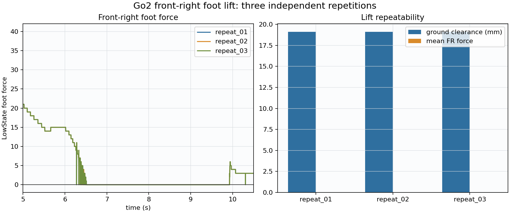
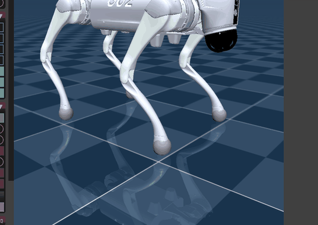

# Go2 前右脚抬升、接触落脚与重心回中

日期：2026-07-16

## 动作流程

```
自然趴稳 → 平滑站立 → 机身后移 7 cm、左移 6 cm
→ FR 抬升目标 4 cm → 保持
→ 缓慢下降，检测到 FR 足底力恢复后停止继续下压
→ 稳定 0.5 s → FR 剩余脚高和机身偏移同时用 3 s 回零
→ 自然站立
```

旧状态机在 FR 落地后仍维持左后重心，四脚重新承重时会产生一次没有实验目的的额外扭动。新版使用接触触发落脚，并让脚高与重心一起回零。

## 三次重复结果

| 运行 | FR 保持段净空 | 保持段 FR 力 | 收尾最大 roll/pitch | 最终 FR 力 | 最终净空 |
|---|---:|---:|---:|---:|---:|
| `repeat_01` | `19.1 mm` | `0` | `0.74° / 1.18°` | `40` | `0.77 mm` |
| `repeat_02` | `19.1 mm` | `0` | `0.74° / 1.18°` | `40` | `0.77 mm` |
| `repeat_03` | `19.1 mm` | `0` | `0.74° / 1.18°` | `40` | `0.77 mm` |

三次结果几乎完全一致。FR 在保持段具有约 `19.1 mm` 世界净空，最终足底力恢复且净空回到接触 margin 范围。



## 最终动图



## 文件

- `repeat_*/data.csv`：三次独立重复数据。
- `summary.csv`：抬脚阶段重复性指标。
- `final_recording/data.csv`：最终动图对应的数据。
- `media/fr_lift_final.gif`：适合 Markdown 和汇报使用的最终动图。
- `../../tools/recording/capture_x11_gif.py`：X11 仿真窗口录制脚本。
