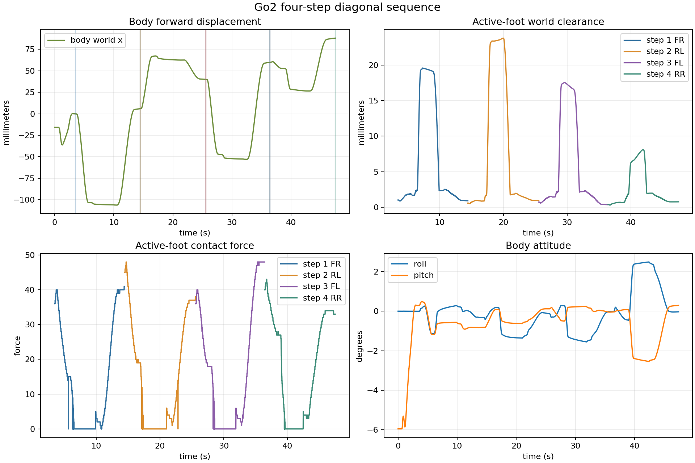

# Go2 四步对角连续前进：FR → RL → FL → RR

日期：2026-08-02

## 实验目的

在 FR→FL 两步连续换腿原语上扩展到四步对角序列，验证控制器能否记住已放置足端和上一阶段机身终点，并连续完成重心转移、抬脚、前摆、接触落脚和机身前移。

## 复现实验

```bash
bash example/cpp/scripts/run_leg_sequence.sh 60 go2_four_step_diagonal_2026-08-02 example/cpp/configs/go2_four_step_fr_rl_fl_rr.txt
```

序列配置文件为 `example/cpp/configs/go2_four_step_fr_rl_fl_rr.txt`。四步均使用 `40 mm` 抬脚和 `60 mm` 前摆；机身前移目标依次为 `25/25/25/25 mm`。

## 实测结果

| 步骤 | 目标腿 | 实际前摆 | 摆脚净空均值/峰值 | 摆脚足底力 | 最大 roll/pitch | 支撑漂移 |
|---|---|---:|---:|---:|---:|---:|
| 1 | FR | 51.2 mm | 19.4 / 19.6 mm | 0 | 1.14° / 1.19° | 10.6 mm |
| 2 | RL | 49.6 mm | 23.5 / 23.8 mm | 0 | 1.35° / 0.81° | 8.1 mm |
| 3 | FL | 45.6 mm | 17.1 / 17.5 mm | 0 | 1.55° / 0.50° | 7.7 mm |
| 4 | RR | 51.7 mm | 7.1 / 8.1 mm | 0 | 2.50° / 2.54° | 5.5 mm |

四次落脚均由足底力触发，控制器在 `46.962 s` 完成四步。机身世界坐标累计前移约 `88.0 mm`，目标累计前移 `100 mm`；四步摆动期间目标腿足底力均为零。



## 结论与边界

四步序列状态机、已放置足端记忆和连续落脚检测已经闭环，说明两步原语可以继续拼接成多步序列。当前采用 `60 mm` 前摆是为了保留稳定余量。

这还不是最终步态：第四步 RR 的净空下降到约 `7 mm`，姿态达到约 `2.54°`，超过当前 `2°` 的严格姿态验收线。下一步需要优化 RR 前的重心轨迹，再扩展到更长距离；当前结果不能外推为已经完成 `10 m` 行走或真机验证。

## 结果文件

- `sequence_summary.csv`：每一步的摆脚、净空、足底力、姿态和支撑漂移指标。
- `sequence_overview.png`：机身世界位移、四步净空、足底力和姿态曲线。
- `controller.log`：落脚触发和序列完成日志（归档，不进 git）。
