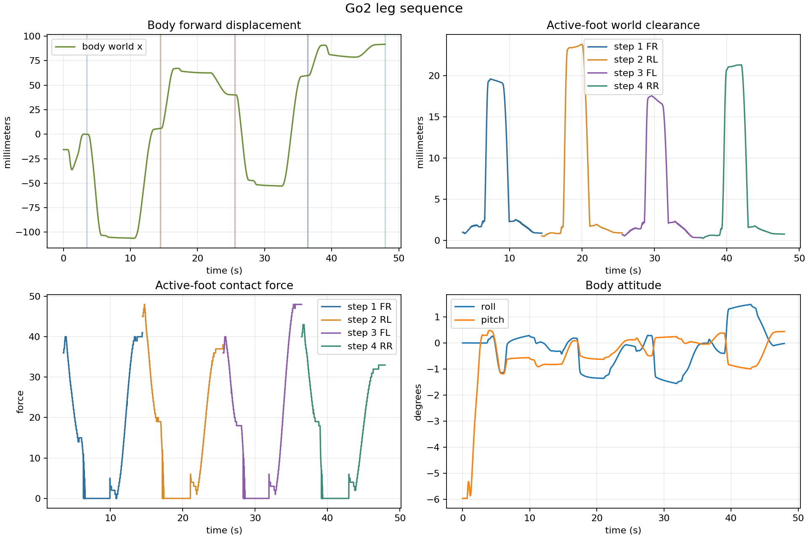

# EXP-14：Go2 四步对角连续前进——RR 前向重心优化

日期：2026-08-02

状态：`accepted`

历史决策：`docs/experiment-ledger.md#exp-14rr-前向重心优化`

## 计划目标

针对四步基线第四步 RR 净空不足、姿态偏大的问题，只增加 RR 的前向重心转移目标，从 `70 mm` 调到 `100 mm`，验证前后方向的支撑分配是否得到改善。

## 实现方式

序列仍为 FR→RL→FL→RR；四步均使用 `40 mm` 抬脚、`60 mm` 前摆和每步 `25 mm` 机身前移。除 RR 前向重心外，其余配置不变。控制器按序保存已放置足端和机身终点，用足底力触发落脚，并由分析器生成统一摘要。

## 遇到的问题

保守基线第四步 RR 的净空只有 `7.1 mm`，最大姿态为 `2.50°/2.54°`，超过当前 `2°` 验收线。侧向微调和较小前移的探针更差，具体比较见 `example/cpp/experiments/_archive/2026-08-02_sequence-development/README.md`。

## 解决路径

只改变 RR 的前向重心目标，把机身在摆动前进一步向前移动，让支撑负载重新分配；不同时改变侧向目标和前摆幅度，保持因果清晰。

## 复现实验

```bash
bash example/cpp/scripts/run_leg_sequence.sh 60 go2_four_step_diagonal_rrx10_2026-08-02 example/cpp/configs/go2_four_step_fr_rl_fl_rr.txt
```

## 实际具体结果

| 步骤 | 目标腿 | 实际前摆 | 摆脚净空均值/峰值 | 摆脚足底力 | 最大 roll/pitch | 支撑漂移 |
|---|---|---:|---:|---:|---:|---:|
| 1 | FR | 51.2 mm | 19.4 / 19.6 mm | 0 | 1.14° / 1.19° | 10.6 mm |
| 2 | RL | 49.6 mm | 23.5 / 23.8 mm | 0 | 1.35° / 0.81° | 8.1 mm |
| 3 | FL | 45.6 mm | 17.1 / 17.5 mm | 0 | 1.55° / 0.50° | 7.7 mm |
| 4 | RR | 55.1 mm | 21.1 / 21.3 mm | 0 | 1.48° / 1.00° | 6.1 mm |

四次落脚均由足底力触发，控制器在 `47.446 s` 完成四步。机身世界坐标累计前移约 `91.8 mm`，目标累计前移 `100 mm`；四步摆动期间目标腿足底力均为零。



## 判定与边界

RR 净空由基线的 `7.1 mm` 增至 `21.1 mm`，最大姿态由 `2.50°/2.54°` 降至 `1.48°/1.00°`，四步全部回到 `2°` 以内。这个结果证明了四步序列的当前可行参数，不代表已经完成 `10 m` 行走、世界位置闭环或真机验证。

## 证据文件

- `sequence_summary.csv`：每一步的摆脚、净空、足底力、姿态和支撑漂移指标。
- `sequence_overview.png`：机身世界位移、四步净空、足底力和姿态曲线。
- `controller.log`：落脚触发和序列完成日志（归档，不进 git）。
- 配置：`example/cpp/configs/go2_four_step_fr_rl_fl_rr.txt`。
