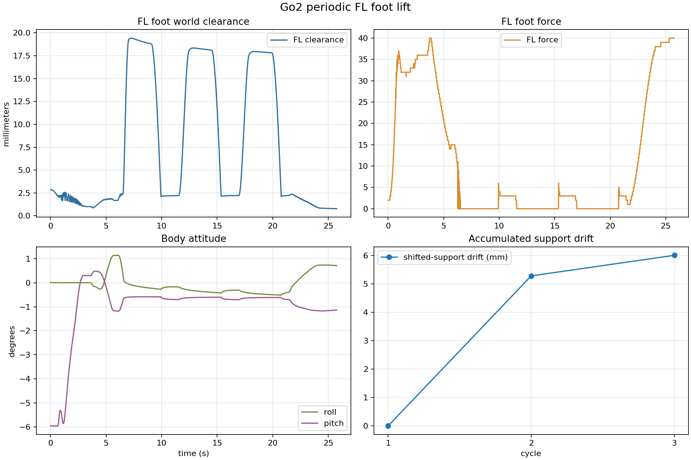

# Go2 前左脚三周期连续抬升

日期：2026-08-02

## 条件

- 目标腿为 FL；机身后移 `7 cm`、右移 `6 cm`，一次性转移，轮间不回中。
- FL 足端向上目标 `4 cm`。
- 连续 3 个抬升—落脚周期；轮间保留接触触发时的 FL 残余高度，最后一轮结束后统一回零。
- 实验由参数化脚本启动：

```bash
example/cpp/scripts/run_periodic_leg_lift.sh 3 45 go2_periodic_leg_lift_fl_3cycles_2026-08-02 FL
```

## 三周期结果

| 周期 | FL 保持段净空 | 保持段 FL 力 | 最大 roll/pitch | 支撑漂移 | 最大关节误差 | 最大估计力矩 |
|---:|---:|---:|---:|---:|---:|---:|
| 1 | `19.1 mm` | `0` | `1.14° / 1.19°` | 基准 | `0.107 rad` | `10.75` |
| 2 | `18.2 mm` | `0` | `0.43° / 0.70°` | `5.3 mm` | `0.103 rad` | `10.32` |
| 3 | `17.9 mm` | `0` | `0.74° / 1.17°` | `6.0 mm` | `0.108 rad` | `10.82` |

三轮抬起期间 FL 足底力均为零，最大姿态变化低于 `2°`，净空、姿态、关节误差和估计力矩没有逐轮恶化。最终回中后平面漂移约 `27.9 mm`，yaw 偏差约 `1.08°`。



## 文件

- `data.csv`：三周期完整原始数据，不在 git。
- `periodic_summary.csv`：各周期关键指标。
- `periodic_overview.png`：净空、足底力、姿态和支撑漂移总览。
- `controller.log`、`simulator.log`：运行日志（不在 git）。
