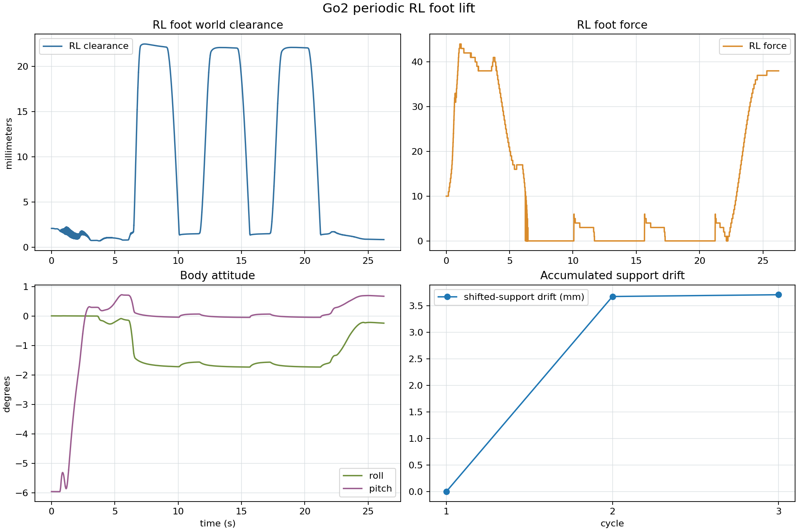

# Go2 后左脚三周期连续抬升

日期：2026-08-02

## 条件

- 目标腿为 RL；机身前移 `7 cm`、右移 `6 cm`，一次性转移，轮间不回中。
- RL 足端向上目标 `4 cm`。
- 连续 3 个抬升—落脚周期；轮间保留接触触发时的 RL 残余高度，最后一轮结束后统一回零。
- 实验由参数化脚本启动：

```bash
example/cpp/scripts/run_periodic_leg_lift.sh 3 45 go2_periodic_leg_lift_rl_3cycles_2026-08-02 RL
```

## 三周期结果

| 周期 | RL 保持段净空 | 保持段 RL 力 | 最大 roll/pitch | 支撑漂移 | 最大关节误差 | 最大估计力矩 |
|---:|---:|---:|---:|---:|---:|---:|
| 1 | `22.3 mm` | `0` | `1.72° / 0.72°` | 基准 | `0.087 rad` | `8.56` |
| 2 | `22.1 mm` | `0` | `1.73° / 0.07°` | `3.7 mm` | `0.077 rad` | `7.72` |
| 3 | `22.1 mm` | `0` | `1.73° / 0.69°` | `3.7 mm` | `0.080 rad` | `7.88` |

三轮抬起期间 RL 足底力均为零，最大姿态变化低于 `2°`，没有出现逐轮恶化。最终回中后平面漂移约 `12.3 mm`，yaw 偏差约 `0.79°`。



## 文件

- `data.csv`：三周期完整原始数据，按仓库规则保留在本机但不纳入 Git。
- `periodic_summary.csv`：各周期关键指标。
- `periodic_overview.png`：净空、足底力、姿态和支撑漂移总览。
- `controller.log`、`simulator.log`：运行日志（归档，不进 git）。
