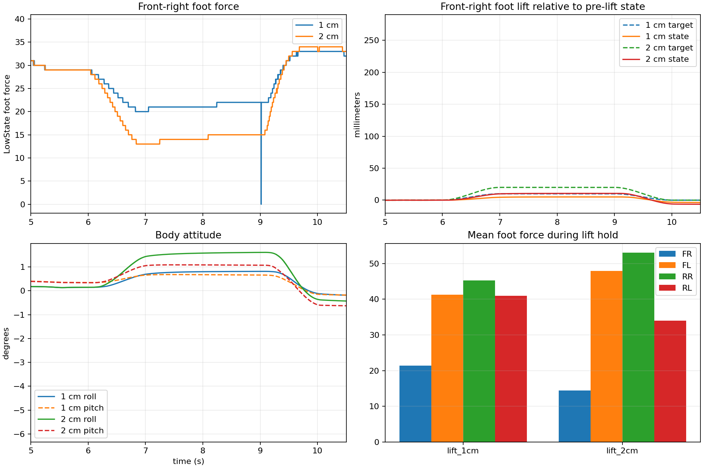

# Go2 前右脚小幅抬升实验

日期：2026-07-16

## 目的

在机身后移 `3 cm`、左移 `2 cm` 的重心转移姿态上，测试前右脚 `1 cm` 和 `2 cm` 足端抬升目标能否使脚真正离地。

## 流程

```
自然趴稳
→ 连续站起 3 s
→ 稳定 0.5 s
→ 重心转移 2 s
→ 稳定 0.5 s
→ FR 抬升 1 s
→ 保持 2 s
→ 落脚 1 s
```

其他三脚保持重心转移后的足端目标不变，FR 的 `z` 目标由逆运动学转换为 hip、thigh、calf 关节目标。

## 结果

| FR 抬升目标 | 实际相对机身抬升 | FR 足底力 | 卸载比例 | 最大 roll/pitch | 是否离地 |
|---|---:|---:|---:|---:|---|
| `1 cm` | `5.0 mm` | `21.4` | `26.1%` | `0.81° / 0.68°` | 否 |
| `2 cm` | `10.5 mm` | `14.5` | `50.1%` | `1.61° / 1.09°` | 否 |

抬升前 FR 足底力约为 `29`。两组实验中 FR 足底力均未接近零，因此没有形成真正的三腿支撑离地状态。目标高度的一部分被地面接触约束和机身运动吸收。



## 结论

单纯继续增大 FR 抬升高度会增加机身倾斜，却不能保证安全离地。当前应先优化重心转移，使抬脚前 FR 足底力进一步降低，再重复小幅抬升实验。

本实验完成了可复现的“重心转移 → 足端抬升 → 保持 → 落脚”控制闭环，但尚未完成真正抬脚。

## 文件

- `lift_1cm/data.csv`：1 cm 原始数据。
- `lift_2cm/data.csv`：2 cm 原始数据。
- `summary.csv`：关键指标汇总。
- `comparison.png`：足底力、足端高度和机身姿态对比。
