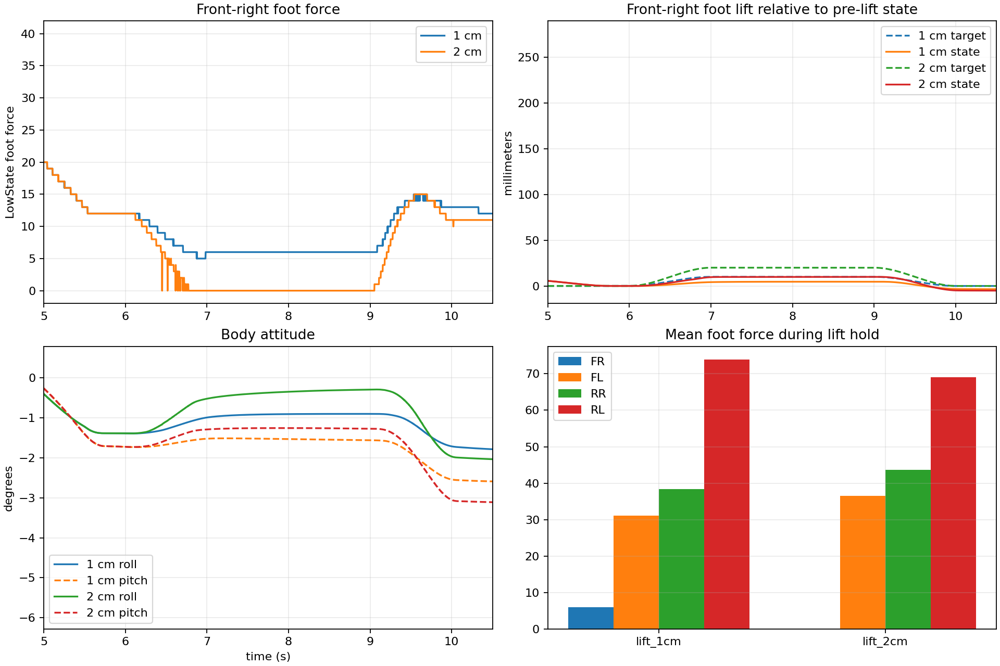

# Go2 优化重心转移后的前右脚抬升

日期：2026-07-16

## 条件

机身先后移 `7.5 cm`、左移 `6 cm`，再分别给前右脚 `1 cm` 和 `2 cm` 的向上足端目标。

## 结果

| FR 抬升目标 | 抬脚前 FR 力 | 保持段 FR 力 | 实际相对机身抬升 | 最大 roll/pitch | 是否离地 |
|---|---:|---:|---:|---:|---|
| `1 cm` | `12.0` | `6.0` | `4.6 mm` | `0.95° / 1.56°` | 否 |
| `2 cm` | `12.0` | `0.0` | `9.9 mm` | `0.46° / 1.27°` | 仅轻微脱离 |

后续加入世界坐标验证后发现，`2 cm` 目标只带来约毫米级的碰撞几何净空，肉眼几乎不可见。因此本文保留为卸载过程记录，不再把它表述为可见的真正抬脚。

## 文件

- `lift_1cm/data.csv`、`lift_2cm/data.csv`：原始数据。
- `summary.csv`：关键指标。
- `comparison.png`：足底力、足端高度、姿态和各脚受力对比。
