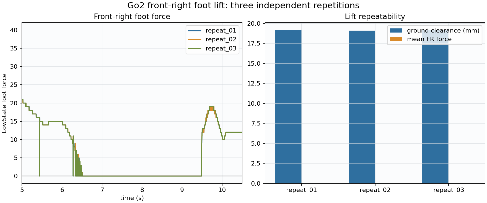
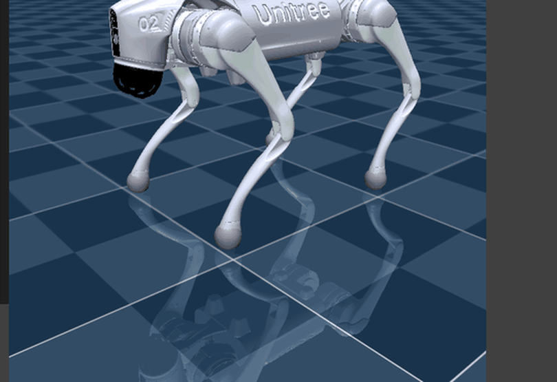

# Go2 前右脚可见抬升与重复性

日期：2026-07-16

## 条件

- 机身后移 `7 cm`、左移 `6 cm`。
- FR 足端向上目标 `4 cm`。
- 通过机身世界位置、IMU 四元数和正运动学计算足端碰撞球最低点的世界净空。

## 三次重复结果

| 运行 | 抬脚前 FR 力 | 保持段 FR 力 | 保持段世界净空 | 净空增加 | 最大 roll/pitch |
|---|---:|---:|---:|---:|---:|
| `repeat_01` | `15.0` | `0.0` | `19.11 mm` | `17.43 mm` | `0.23° / 0.59°` |
| `repeat_02` | `15.0` | `0.0` | `19.11 mm` | `17.43 mm` | `0.23° / 0.59°` |
| `repeat_03` | `15.0` | `0.0` | `19.12 mm` | `17.44 mm` | `0.22° / 0.60°` |

三次结果几乎重合，证明该条件能够稳定产生肉眼可见的前右脚净空。

## 落脚核对

落脚稳定段 FR 世界净空约为 `1.75 mm`，与抬脚前的 `1.72 mm` 基本相同；足底力由 `0` 恢复到约 `12`，说明 FR 确实重新接触地面。MuJoCo 的接触 margin 使接触状态下的几何计算仍显示约 `1–2 mm`。

## 动图

当前动图用于展示可见净空。最终汇报版还会在“落脚后重心回中”状态机优化完成后重新录制右侧近景。

## 文件

- `repeat_*/data.csv`：三次独立重复数据。
- `summary.csv`：重复性指标。
- `repeatability.png`：三次足底力与净空对比。
- `media/`：录屏动图和检查用抽帧。
