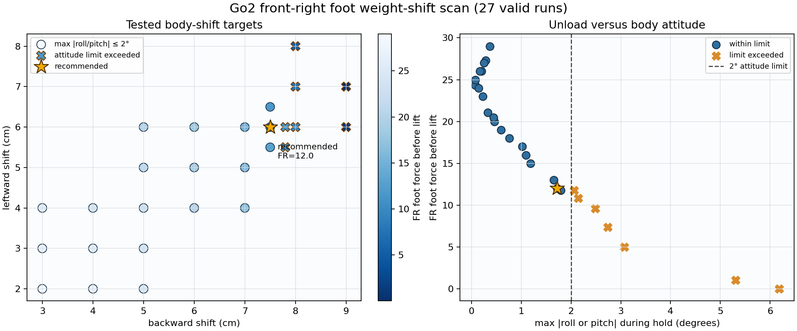

# Go2 前右脚卸载二维扫描

日期：2026-07-16

## 目的

在抬脚前扫描机身向左后方的位移，寻找能显著降低前右脚足底力、同时保持机身姿态稳定的重心转移目标。

## 方法

- 后移范围：`3–9 cm`。
- 左移范围：`2–8 cm`。
- 共获得 `27` 组有效实验数据；`9 cm` 后移、`8 cm` 左移因超过 Go2 关节限位被拒绝。
- 每组均重新启动 MuJoCo，从相同的自然趴稳状态开始。
- 选择约束：重心转移保持段最大绝对 roll 和 pitch 均不超过 `2°`。

## 结果

原基准“后移 `3 cm`、左移 `2 cm`”的 FR 足底力约为 `29`。扩大位移后，FR 受力持续下降，但超过约 `8 cm` 后移时机身姿态快速恶化。

| 目标（后/左） | FR 足底力 | FR 卸载 | 最大 roll/pitch | 判断 |
|---|---:|---:|---:|---|
| `3 / 2 cm` | `29.0` | `19.4%` | `0.14° / 0.37°` | 原基准 |
| `7 / 6 cm` | `15.0` | `58.3%` | `1.14° / 1.18°` | 稳定 |
| `7.5 / 6 cm` | `12.0` | `66.7%` | `1.39° / 1.72°` | 推荐 |
| `7.8 / 6 cm` | `10.8` | `69.9%` | `1.58° / 2.14°` | 超过姿态边界 |
| `8 / 6 cm` | `9.6` | `73.4%` | `1.73° / 2.49°` | 超过姿态边界 |
| `9 / 7 cm` | `0.0` | `100.0%` | `4.17° / 6.18°` | 明显失稳 |

后移 `7.5 cm`、左移 `6 cm` 并不是 FR 力绝对最低的组合，而是在 `2°` 姿态约束内保留一定安全余量的折中点。与 `7.5 / 6.5 cm` 相比，它的 FR 力只高约 `0.2`，但 pitch 和左后脚负载更低，因此更适合作为抬脚基准。

## 后续验证

使用推荐重心转移目标重新测试：

- `1 cm` 抬脚：FR 力由 `12` 降到 `6`，尚未离地。
- `2 cm` 抬脚：FR 保持段足底力为 `0`，实际相对机身抬升约 `9.9 mm`，最大 roll/pitch 为 `0.46° / 1.27°`，成功形成稳定三腿支撑。

## 文件

- 各子目录的 `data.csv`：扫描原始数据。
- `summary.csv`：所有有效组合的关键指标。
- `scan_overview.png`：位移、FR 足底力与姿态边界总览。
- `../../scripts/run_weight_shift_scan.sh`：可复现扫描脚本。
